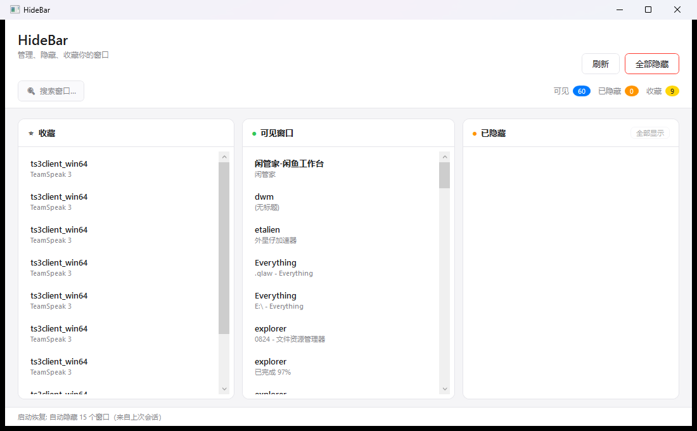

# GhostPane

一个轻量级的 Windows 窗口隐藏工具，帮你管理、隐藏、收藏桌面上的窗口。

## 功能

- **隐藏窗口** — 选中窗口后点击"隐藏"按钮，窗口立即从桌面消失
- **恢复窗口** — 在"已隐藏"栏中点击"显示"按钮恢复窗口
- **全部隐藏/显示** — 一键操作所有窗口
- **收藏管理** — 按进程收藏窗口，双击收藏栏可批量切换隐藏状态
- **搜索过滤** — 快速搜索窗口名称
- **状态持久化** — 关闭程序后再次打开，之前隐藏的窗口会自动恢复隐藏

## 截图



## 下载

前往 [Releases](../../releases) 页面下载最新版本。

## 使用方法

1. 下载并运行 `GhostPane.exe`
2. 在"可见窗口"列表中点击选中一个窗口
3. 点击右侧的 **"隐藏"** 按钮，窗口即刻隐藏
4. 在"已隐藏"列表中点击 **"显示"** 按钮可恢复窗口

## 从源码构建

### 环境要求

- Windows 10/11
- [.NET 8.0 SDK](https://dotnet.microsoft.com/download/dotnet/8.0)

### 构建步骤

```bash
git clone https://github.com/your-username/GhostPane.git
cd GhostPane
dotnet publish -c Release -r win-x64 --self-contained false -o publish
```

生成的可执行文件位于 `publish/GhostPane.exe`。

## 项目结构

```
GhostPane/
├── App.xaml / App.xaml.cs          # 应用入口
├── MainWindow.xaml / .cs           # 主窗口界面
├── RelayCommand.cs                 # ICommand 实现
├── AssemblyInfo.cs                 # 程序集信息
├── icon.ico                        # 应用图标
├── Models/
│   └── WindowInfo.cs               # 窗口信息模型
├── ViewModels/
│   ├── MainViewModel.cs            # 主逻辑
│   └── ViewModelBase.cs            # INotifyPropertyChanged 基类
├── Services/
│   ├── WindowController.cs         # Win32 窗口操作
│   ├── WindowEnumerator.cs         # 窗口枚举
│   ├── HiddenStore.cs              # 隐藏状态持久化
│   └── FavoriteStore.cs            # 收藏持久化
├── Styles/
│   └── AppleTheme.xaml             # Apple 风格主题
└── Converters/
    └── NullToVisibilityConverter.cs
```

## 技术栈

- C# / WPF (.NET 8.0)
- Win32 API（`ShowWindow` / `EnumWindows`）
- MVVM 架构

## 许可证

[MIT License](LICENSE)
